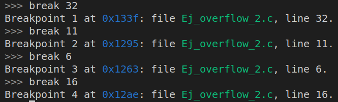
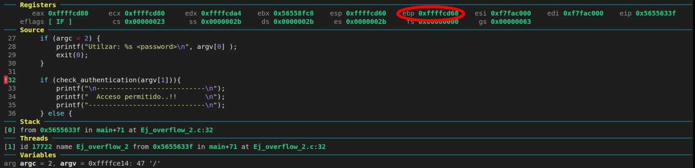
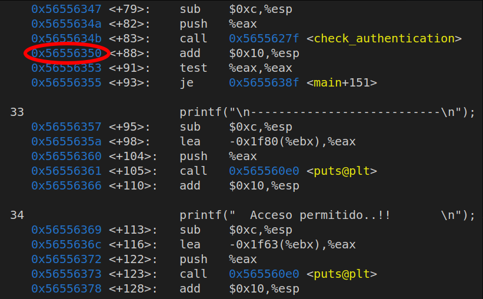
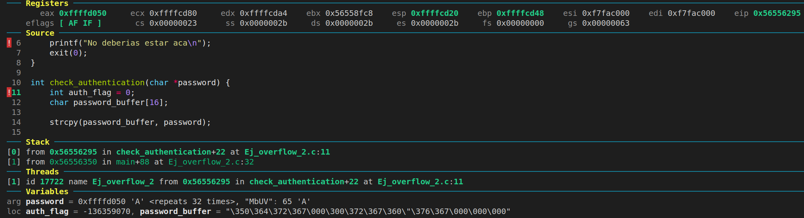
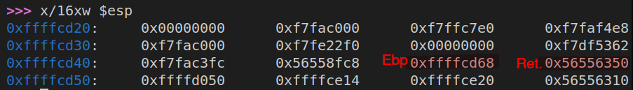
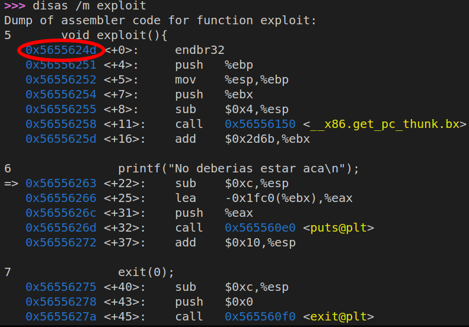
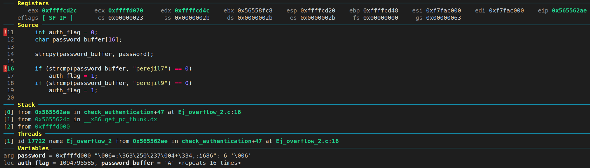
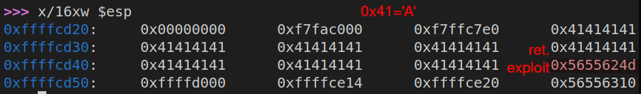
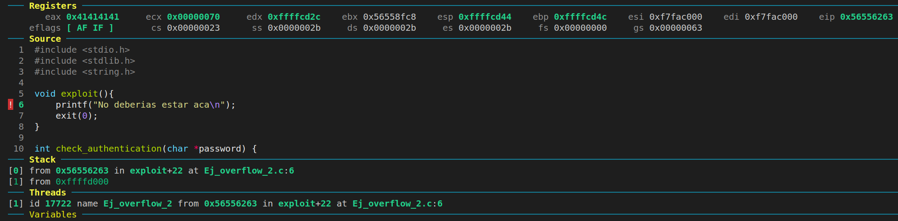
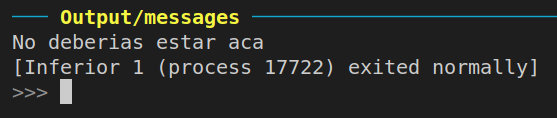

# **TP2 BUFFER OVERFLOW**

El objetivo del siguiente trabajo práctico es poder modificar la dirección de retorno ubicada en el stack del main para poder ejecutar una función personalizada.

Antes de comenzar con la aplicación estuvimos haciendo un poco de investigación, a continuación citamos la bibliografía

* En la carpeta material se puede encontrar un par de pdf con bibliografía que se nos dio en clases.

* [Fundación sadosky](https://fundacion-sadosky.github.io/guia-escritura-exploits/buffer-overflow/1-introduccion.html)

* [Articulo buffer overflow](http://phrack.org/issues/49/14.html#article)

* [No stack protector](https://en.wikipedia.org/wiki/Buffer_overflow_protection)
___
### Primeras aproximaciones 
La primera aproximacion al estudio de estas herramientas fue un [foro](https://wiki.elhacker.net/bugs-y-exploits/overflows-y-shellcodes/bufferoverflow)  el cual se detallaba como ejecutar un exploit utilizando diversas herramientas como scripts en perl y programas en c para generar argumentos a medida de lo pedido, ahi se detallaban conceptos en torno a los bytes de proteccion, uso de no-ops para saltarsela, tambien hablaba de los problemas que representaba no poder hacer que los datos se correspondieran con las posicisiones deseadas. Laa solucion del problema que se planteaba era mas grande del que nos estabamos enfrentando por eso las ideas planteadas ahi no se implmentaron, sin embargo resultaron ilustrativas del tipo de problema al que nos enfrentabamos.
___

### Compilacion y flags

Para poder realizar lo solicitado vamos a tener que utilizar algunas flags especiales del compilador gcc, primero veamos el comando.
  
```gcc -g -o Ej_overflow_2 Ej_overflow_2.c -m32 -fno-stack-protector```
  
* ```-m32```: le estamos diciendo que lo compile en 32 bits, es decir, el programa se ejecutará como en una arquitectura 32 bits.
* ```-fno-stack-protector```: desactivamos la protección del stack, esta proteccion se encarga de colocar palabras conocidas ("Stack Canaries") entre el buffer y la informacion de control (ebp, ret address) las cuales si son modificadas producen un stack smashing ya que se detecta que se hizo un buffer overflow.

Utilizando las herramientas de gbd sumado a los plugins [dashboard](https://github.com/cyrus-and/gdb-dashboard) y [voltron](https://github.com/snare/voltron), pudimos ver las direcciones de memoria y como estas se iban llenando con los elementos que cargamos con 

___

### Pasos de ejecución

1.  
    Ponemos los breakpoints y corremos el script de perl con el cual colocamos la cantidad de 'A's necesarias para luego modificar la dirección de retorno a la función exploit ubicada en la direccion "MbUV".
      
    ```run $(perl -e 'print "A"x32 . "MbUV"')```
 
  

2.  
    Localizamos el base pointer original.
  


3.  
    Identificamos la dirección de retorno original.
  


4.  
    Nos frenamos en este breakpoint.
  


5.  
    Vemos el stack en el lugar del breakpoint.
  


6. 
    Identificamos la dirección de la función exploit.


    

7. 
    Vemos el siguiente breakpoint.


    

8. 
    Vemos como quedo el stack sobreescrito.


    

9. 
    Nos posicionamos en el breakpoint de la función exploit.
  


10.
    Se puede observar como es evidente que la ejecución cambió y ahora corre una función que no se llamó desde el programa principal.
  
